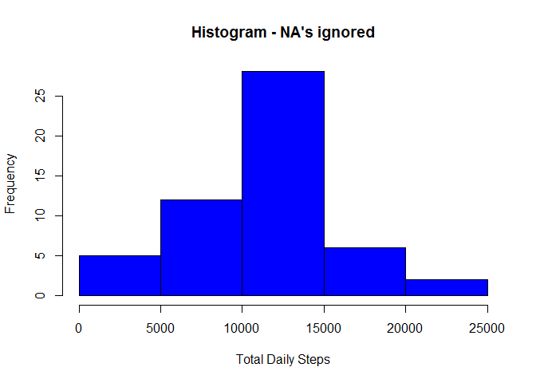

# Reproducible Research: Peer Assessment 1
Gene Kaufman, based on template cloned from [http://github.com/rdpeng/RepData_PeerAssessment1](http://github.com/rdpeng/RepData_PeerAssessment1)  
## Loading and preprocessing the data
First, we're going to set some global options (shamelessly copied from video notes)

```r
require(knitr)
opts_chunk$set(echo=TRUE, results="asis", warning=FALSE, message=FALSE)
```

Download data file, if necessary. Unzip and save to local computer

```r
zip_file_url<-"https://d396qusza40orc.cloudfront.net/repdata%2Fdata%2Factivity.zip"
zip_file_local<-"repdata_data_activity.zip"
data_file<-"activity.csv"
if (!file.exists(zip_file_local)) {
  download.file(zip_file_url,destfile = zip_file_local,mode="wb")
}
if (!file.exists(zip_file_local)) {
  stop("Failed to retrieve zip file!")
}
unzip(zip_file_local)
```

Read data, create some lists that will be useful later

```r
data_raw<-read.csv(data_file)
unlink(data_file)	# we don't need to keep the unzipped file around any longer

library(dplyr)

na_steps_ndx <- is.na(data_raw$steps)		# index of NAs
intervals_list<-unique(data_raw$interval)	# list of intervals
```

Create a data frame without NA's (nona)

```r
data_nona_by_day<-data_raw %>%
  filter(!is.na(steps)) %>%
  group_by(date)  %>%
  summarize(daily_steps_total=sum(steps))
```

## What is mean total number of steps taken per day?

```r
daily_nona_steps_mean <-mean(data_nona_by_day$daily_steps_total)
daily_nona_steps_median<-median(data_nona_by_day$daily_steps_total)
print(daily_nona_steps_mean)
```

[1] 10766.19
The mean total number of steps taken per day is **1.0766189\times 10^{4}**, with a median of **10765** steps.

```r
with(data_nona_by_day,
     hist(daily_steps_total,
          main="Histogram - NA's ignored",
          xlab="Total Daily Steps",
          col="blue"))
```

 
          
## What is the average daily activity pattern?


## Imputing missing values


## Are there differences in activity patterns between weekdays and weekends?
