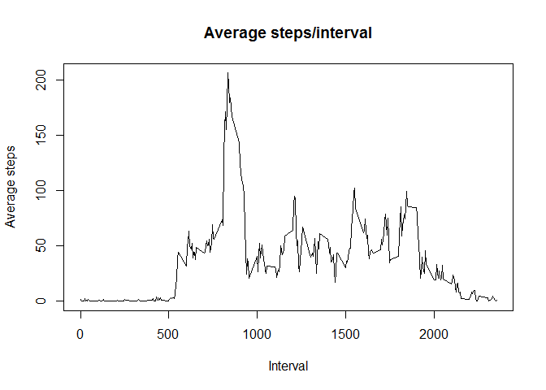

# Reproducible Research: Peer Assessment 1
Gene Kaufman, based on template cloned from [http://github.com/rdpeng/RepData_PeerAssessment1](http://github.com/rdpeng/RepData_PeerAssessment1)  
## Loading and preprocessing the data
First, we're going to set some global options (shamelessly copied from video notes)

```r
require(knitr)
opts_chunk$set(echo=TRUE, results="asis", warning=FALSE, message=FALSE)
library(dplyr)

# replace default knitr inline formatter to more nicely display numbers that
# don't need to use scientific notation
# inline_hook solution credit: Jason French and Winston Chang
#  http://www.jason-french.com/blog/2014/04/25/formatting-sweave-and-knitr-output-for-2-digits/
inline_hook <- function(x){
  if(is.numeric(x)){
    res <- ifelse(x == round(x),
        sprintf("%d",x),
        sprintf("%.4f",x)
    )
    paste(res,collapse=", ")
  }
}
knit_hooks$set(inline=inline_hook)
```

Download data file, if necessary. Unzip and save to local computer

```r
zip_file_url <- "https://d396qusza40orc.cloudfront.net/repdata%2Fdata%2Factivity.zip"
zip_file_local <- "repdata_data_activity.zip"
data_file <- "activity.csv"
if (!file.exists(zip_file_local)) {
  download.file(zip_file_url,destfile = zip_file_local,mode="wb")
}
if (!file.exists(zip_file_local)) {
  stop("Failed to retrieve zip file!")
}
unzip(zip_file_local)
```

Read data, create some lists that will be useful later

```r
data_raw <- read.csv(data_file)
unlink(data_file)	# we don't need to keep the unzipped file around any longer

na_steps_ndx <- is.na(data_raw$steps)		# index of NAs
intervals_list <- unique(data_raw$interval)	# list of intervals
```


Create a data frame without NA's (nona), grouped by day

```r
data_nona_by_day<-data_raw %>%
  filter(!is.na(steps)) %>%
  group_by(date)  %>%
  summarize(daily_steps_total=sum(steps))
```

## What is mean total number of steps taken per day?


```r
daily_nona_steps_mean <- mean(data_nona_by_day$daily_steps_total)
daily_nona_steps_median <- median(data_nona_by_day$daily_steps_total)
```

Ignoring NAs, the mean total number of steps taken per day is **10766.1887**, with a median of **10765** steps.

*Make a histogram of the total number of steps taken each day*

```r
with(data_nona_by_day,
     hist(daily_steps_total,
          main="Histogram - NA's ignored",
          xlab="Total Daily Steps",
          col="blue"))
```

 
          
## What is the average daily activity pattern?

Create a data frame without NA's (nona), grouped by interval

```r
data_nona_by_interval <- data_raw %>%
  filter(!is.na(steps)) %>%
  group_by(interval)  %>%
  summarize(interval_steps_mean = mean(steps),
            interval_steps_total = sum(steps))
```

*Make a time series plot (i.e. type = "l") of the 5-minute interval (x-axis) and the average number of steps taken, averaged across all days (y-axis)*

```r
with(data_nona_by_interval,
     plot(interval,interval_steps_mean, type = "l"))
```

 

*Which 5-minute interval, on average across all the days in the dataset, contains the maximum number of steps?*

```r
max_interval_steps<-intervals_list[which.max(data_nona_by_interval$interval_steps_total)]
```
The interval with the highest average across all days is **835**.

## Imputing missing values


## Are there differences in activity patterns between weekdays and weekends?
